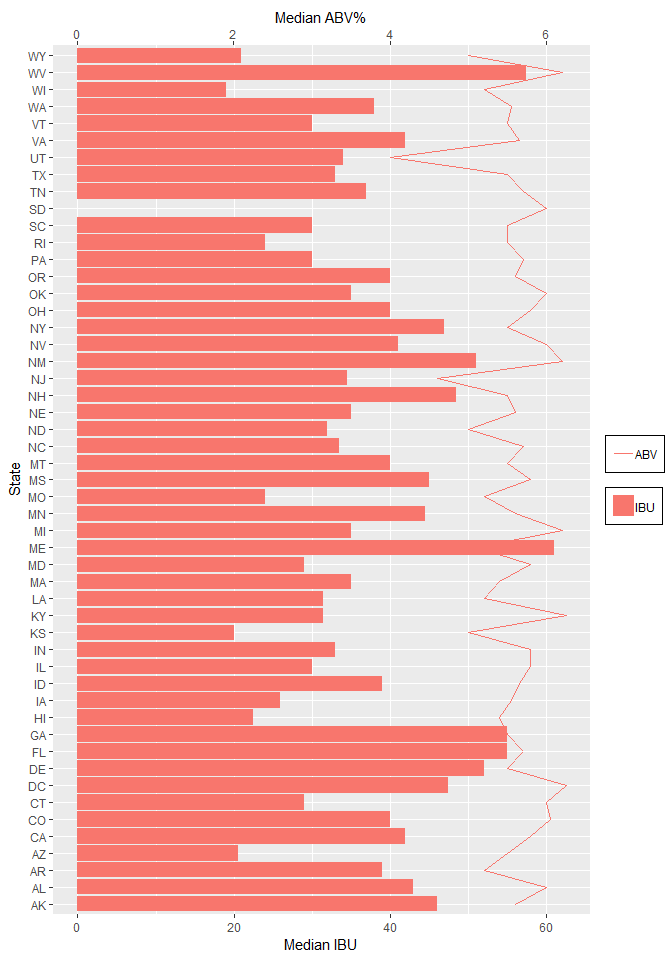
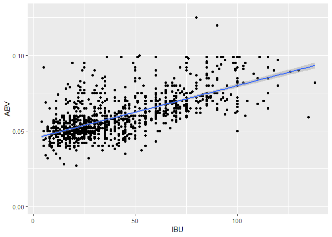

# Purpose
This study analyzes two data sets related to beer (breweries and the beer). The number of breweries for each state will be totaled and then We will look at the bitterness (IBU) and alcohol by volume (ABV) per state for all breweries in that state. We then will look further into the relationship between IBU and ABV and see if there is a correlation.

# Load Data


```r
# Load Beers data
Beers <- read.csv("Beers.csv")
# Load Breweries data
Breweries <- read.csv("Breweries.csv")
# Adjust brewery ID column of Beers dataset to match brewery ID column name of Breweries dataset
colnames(Beers) [colnames(Beers)=="Brewery_id"] <- "Brew_ID"
```

# Question 1 - How Many breweries are in each state?
The following table displays the count of breweries for each state in the United States and the District of Columbia.

```r
#load data.table package
library(data.table)
#generate datatable with count of breweries for each state
breweries.by.state <- data.table(table(Breweries$State))
#assign variable names to datatable
colnames(breweries.by.state) <- c("State","Count")
#load knitr package
library(knitr)
kable(breweries.by.state)
```


State    Count
------  ------
AK           7
AL           3
AR           2
AZ          11
CA          39
CO          47
CT           8
DC           1
DE           2
FL          15
GA           7
HI           4
IA           5
ID           5
IL          18
IN          22
KS           3
KY           4
LA           5
MA          23
MD           7
ME           9
MI          32
MN          12
MO           9
MS           2
MT           9
NC          19
ND           1
NE           5
NH           3
NJ           3
NM           4
NV           2
NY          16
OH          15
OK           6
OR          29
PA          25
RI           5
SC           4
SD           1
TN           3
TX          28
UT           4
VA          16
VT          10
WA          23
WI          20
WV           1
WY           4

# Question 2 - Merge the two data files together and show the first 6 and last 6 rows of the data.
For further analysis, the 2 files will be merged.  The following two tables display the first 6 rows and last 6 rows of the new combined dataset.

```r
#Merge 2 dataframes by column "Brew_ID"
beer.data.merged <- merge(Beers,Breweries, by ="Brew_ID")
#Clarify naming of "Name" columns
colnames(beer.data.merged)[colnames(beer.data.merged)=="Name.x"] <- "Beer Name"
colnames(beer.data.merged)[colnames(beer.data.merged)=="Name.y"] <- "Brewery Name"

#Display first 6 lines
kable(head(beer.data.merged,6))
```


 Brew_ID  Beer Name        Beer_ID     ABV   IBU  Style                                  Ounces  Brewery Name        City          State 
--------  --------------  --------  ------  ----  ------------------------------------  -------  ------------------  ------------  ------
       1  Get Together        2692   0.045    50  American IPA                               16  NorthGate Brewing   Minneapolis   MN    
       1  Maggie's Leap       2691   0.049    26  Milk / Sweet Stout                         16  NorthGate Brewing   Minneapolis   MN    
       1  Wall's End          2690   0.048    19  English Brown Ale                          16  NorthGate Brewing   Minneapolis   MN    
       1  Pumpion             2689   0.060    38  Pumpkin Ale                                16  NorthGate Brewing   Minneapolis   MN    
       1  Stronghold          2688   0.060    25  American Porter                            16  NorthGate Brewing   Minneapolis   MN    
       1  Parapet ESB         2687   0.056    47  Extra Special / Strong Bitter (ESB)        16  NorthGate Brewing   Minneapolis   MN    

```r
#Display last 6 lines
kable(tail(beer.data.merged,6))
```

        Brew_ID  Beer Name                    Beer_ID     ABV   IBU  Style                      Ounces  Brewery Name                    City            State 
-----  --------  --------------------------  --------  ------  ----  ------------------------  -------  ------------------------------  --------------  ------
2405        556  Pilsner Ukiah                     98   0.055    NA  German Pilsener                12  Ukiah Brewing Company           Ukiah           CA    
2406        557  Heinnieweisse Weissebier          52   0.049    NA  Hefeweizen                     12  Butternuts Beer and Ale         Garrattsville   NY    
2407        557  Snapperhead IPA                   51   0.068    NA  American IPA                   12  Butternuts Beer and Ale         Garrattsville   NY    
2408        557  Moo Thunder Stout                 50   0.049    NA  Milk / Sweet Stout             12  Butternuts Beer and Ale         Garrattsville   NY    
2409        557  Porkslap Pale Ale                 49   0.043    NA  American Pale Ale (APA)        12  Butternuts Beer and Ale         Garrattsville   NY    
2410        558  Urban Wilderness Pale Ale         30   0.049    NA  English Pale Ale               12  Sleeping Lady Brewing Company   Anchorage       AK    

# Question 3 - Display the number of NA values for each column
In order to identify missing values in the dataset, the following table displays the number of records with missing values for each of the following columns in the data.

```r
kable(colSums(is.na(beer.data.merged)), col.names=c("Count"))
```

                Count
-------------  ------
Brew_ID             0
Beer Name           0
Beer_ID             0
ABV                62
IBU              1005
Style               0
Ounces              0
Brewery Name        0
City                0
State               0

# Question 4 - Compute and plot the median ABV and IBU for each state
In order to visually analyze the median ABV as compared to the median IBU for each state to determine if there is a relationship between the two variables, the following chart displays a barchart of the IBU values compared to a line chart of ABV values.  The scale for the ABV calculations is 1:10 of the scale for IBU, with the scale values displayed on the top for ABV and on the bottle for IBU

```r
#Calculate median ABV by State
med.ABV<-aggregate(IBU ~ State, beer.data.merged, median)
#Calculate median IBU by State
med.IBU<-aggregate(ABV ~ State, beer.data.merged, median)
#Load reshape2
library(reshape2)
```

```
## 
## Attaching package: 'reshape2'
```

```
## The following objects are masked from 'package:data.table':
## 
##     dcast, melt
```

```r
#Melt data for ggplot2
IBU <- melt(med.ABV)
```

```
## Using State as id variables
```

```r
ABV <- melt(med.IBU)
```

```
## Using State as id variables
```

```r
#Load ggplot2
library(ggplot2)
#Plot IBU and ABV
ggplot() +
  geom_bar(data=IBU, aes(x=State, y=value, fill=variable),stat = "identity") + 
  geom_line(data=ABV, aes(x=State, y=value*1000, colour=variable, group=1), stat="identity") +
  coord_flip() +
  theme(legend.key = element_blank(), 
        legend.background = element_rect(colour = 'black', fill = 'white'), 
        legend.position = "right", legend.title = element_blank(),
        legend.box.just = "left") +
  scale_y_continuous(sec.axis = sec_axis(~./10, name="Median ABV%")) +
  ylab("Median IBU") 
```

<!-- -->

# Question 5 - Which state has the maximum ABV and which has the maximum IBU?
The beers with the highest ABV values and highest IBU values are displayed in the following tables.

```r
#Highest ABV
kable(beer.data.merged[which.max(beer.data.merged$ABV),c(2,4:10)], caption="Highest ABV")
```


Table: Highest ABV

      Beer Name                                                 ABV   IBU  Style               Ounces  Brewery Name              City      State 
----  -----------------------------------------------------  ------  ----  -----------------  -------  ------------------------  --------  ------
375   Lee Hill Series Vol. 5 - Belgian Style Quadrupel Ale    0.128    NA  Quadrupel (Quad)      19.2  Upslope Brewing Company   Boulder   CO    

```r
#Highest IBU
kable(beer.data.merged[which.max(beer.data.merged$IBU),c(2,4:10)], caption="Highest IBU")
```


Table: Highest IBU

       Beer Name                      ABV   IBU  Style                             Ounces  Brewery Name              City      State 
-----  --------------------------  ------  ----  -------------------------------  -------  ------------------------  --------  ------
1857   Bitter Bitch Imperial IPA    0.082   138  American Double / Imperial IPA        12  Astoria Brewing Company   Astoria   OR    

# Question 6 - Display the summary statistics of ABV
The following table displays a numerical analysis of of values of the ABV column.

```r
summary(beer.data.merged$ABV)
```

```
##    Min. 1st Qu.  Median    Mean 3rd Qu.    Max.    NA's 
## 0.00100 0.05000 0.05600 0.05977 0.06700 0.12800      62
```

#7 Question 7 - Display a scatterplot to show the relationship between bitterness and ABV
The scatterplot below displays further analysis of the relationship between IBU and BV.  The line and the shading around it represents a linear model and the confidence interval.  

```r
#Display scatterplot of ABV vs IBU, including linear model and confidence interval
ggplot(beer.data.merged, aes(x=IBU, y=ABV)) + geom_point() + geom_smooth(method=lm)
```

```
## Warning: Removed 1005 rows containing non-finite values (stat_smooth).
```

```
## Warning: Removed 1005 rows containing missing values (geom_point).
```

<!-- -->

```r
cor.test(beer.data.merged$ABV,beer.data.merged$IBU)
```

```
## 
## 	Pearson's product-moment correlation
## 
## data:  beer.data.merged$ABV and beer.data.merged$IBU
## t = 33.863, df = 1403, p-value < 2.2e-16
## alternative hypothesis: true correlation is not equal to 0
## 95 percent confidence interval:
##  0.6407982 0.6984238
## sample estimates:
##       cor 
## 0.6706215
```

# Conclusion

With a p-value < .0001 there is significant evidence that the null hypothesis that there is a correlation between the ABV and IBU of beers. We can be 95% confident that the correlation between ABU and IBU is between .64 and .70. It is worth noting that 1005 beers out of 2410 do not have an IBU value, excluding them from this correlation analysis.
